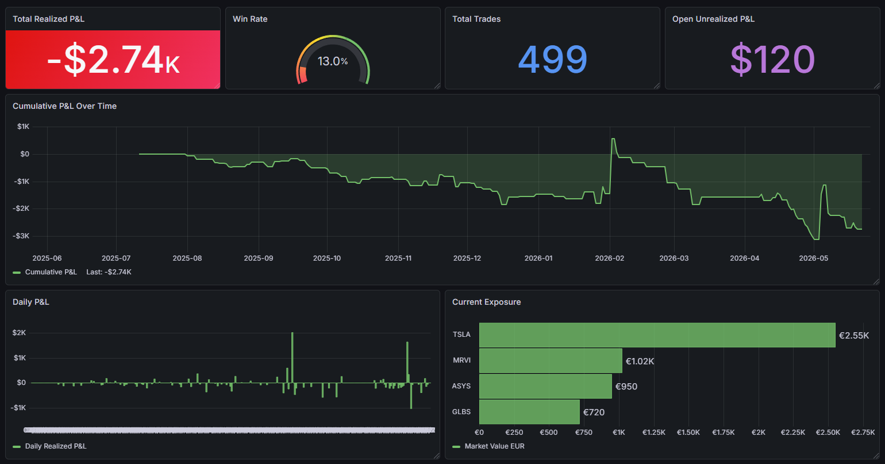

# IBKR Dashboard

IBKR Dashboard is a Spring Boot, PostgreSQL, and Grafana trading journal for Interactive Brokers accounts.

It imports historical executions from IBKR Flex, syncs current positions from TWS, stores the data in PostgreSQL, and exposes a Grafana dashboard for realized P&L, positions, and trading-review workflows. The project is built around base-currency-safe P&L so trades in USD, HKD, NOK, TWD, EUR, and other currencies are not incorrectly summed as raw values.



## Features

- Current position sync from the IBKR TWS API.
- Historical trade import from the IBKR Flex Web Service.
- Incremental daily sync and one-time history backfill.
- Base-currency realized P&L using IBKR `fxRateToBase`.
- P&L rebuild into `daily_pnl` for Grafana panels.
- PostgreSQL schema managed with Flyway migrations.
- Grafana provisioning for datasource and dashboard files.
- OpenAPI/Swagger documentation for sync endpoints.
- Retry/backoff around transient IBKR Flex errors.
- Date handling using `dd-MM-yyyy` request parameters.

## Local Installation

### Prerequisites

- Java 21.
- Docker Desktop or Docker Engine.
- IBKR TWS or IB Gateway running with API access enabled.
- IBKR Flex Web Service token and Activity Flex Query ID.

Default local URLs:

- Grafana: `http://localhost:3000`
- API: `http://localhost:8080`
- Swagger UI: `http://localhost:8080/swagger-ui.html`
- PostgreSQL: `localhost:5432`

### Environment Variables

Typical IntelliJ environment string:

```text
IBKR_ACCOUNT_ID=<YOUR_IBKR_ACCOUNT_ID>;IBKR_FLEX_BASE_URL=https://ndcdyn.interactivebrokers.com/AccountManagement/FlexWebService;IBKR_FLEX_TOKEN=<YOUR_IBKR_FLEX_TOKEN>;IBKR_FLEX_TRADES_QUERY_ID=<YOUR_IBKR_FLEX_QUERY_ID>;IBKR_FLEX_VERSION=3;IBKR_HISTORY_CHUNK_DAYS=90;IBKR_HISTORY_CHUNK_DELAY_SECONDS=5;IBKR_HISTORY_FROM_DATE=01-01-2026;IBKR_TWS_CLIENT_ID=101;IBKR_TWS_HOST=127.0.0.1;IBKR_TWS_PORT=5000;IBKR_TWS_TIMEOUT_SECONDS=20;POSTGRES_DB=trading_db;POSTGRES_HOST=localhost;POSTGRES_PASSWORD=<YOUR_POSTGRES_PASSWORD>;POSTGRES_PORT=5432;POSTGRES_USER=trading_user;SERVER_PORT=8080;SPRING_PROFILES_ACTIVE=docker
```

Notes:

- Dates use `dd-MM-yyyy`.
- `POSTGRES_HOST=localhost` is for running Spring Boot from IntelliJ or Maven on the host.
- Use `POSTGRES_HOST=postgres` only when the app itself runs inside Docker Compose.
- `IBKR_HISTORY_CHUNK_DELAY_SECONDS` slows down history backfills to avoid Flex token throttling.
- Flex end dates are clamped to the last completed business day because current-day Activity Flex data can be unavailable.

### Run Locally With Maven

Use Docker for PostgreSQL and Grafana:

```powershell
docker-compose up postgres grafana -d
```

Then run the Spring Boot app from the host:

```powershell
.\mvnw.cmd spring-boot:run
```

For Linux/macOS:

```bash
./mvnw spring-boot:run
```

This mode is usually best during development because TWS/IB Gateway often runs on the host machine and the API can reach it at `127.0.0.1`.

### Run With Docker

Run PostgreSQL, Grafana, and the API through Docker Compose:

```powershell
docker-compose up --build -d
```

When the API runs inside Docker, configure:

```text
POSTGRES_HOST=postgres
```

If TWS or IB Gateway runs on the host machine, `127.0.0.1` from inside the container points to the container itself, not the host. Configure `IBKR_TWS_HOST` accordingly for your OS/network setup.

## API Endpoints

### `POST /sync`

Normal dashboard refresh. This is the endpoint Grafana should call.

It:

- Syncs current positions from TWS.
- Finds the latest trade date stored in PostgreSQL.
- Imports Flex trades from that date through the last completed business day.
- Rebuilds daily P&L for that same range.

### `POST /sync/history`

One-time/admin history backfill.

Defaults:

- `from = IBKR_HISTORY_FROM_DATE`
- `to = last completed business day`

Optional params:

```text
POST /sync/history?from=01-01-2026&to=20-05-2026
```

It imports trades in chunks, rebuilds P&L for the full range, and refreshes current positions at the end. The account-profile check is capped to IBKR's 366-day Flex limit; the trade import itself is chunked across the requested range.

### `POST /sync/trades`

Manual trade import for a specific range:

```text
POST /sync/trades?from=11-05-2026&to=15-05-2026
```

Trades are deduplicated by `ibkr_execution_id`. If an existing execution is imported again, the row is updated so parsed fields such as FX rate and base-currency amounts can be backfilled.

### `POST /sync/pnl`

Rebuilds `daily_pnl` from stored trades:

```text
POST /sync/pnl?from=11-05-2026&to=15-05-2026
```

If no dates are provided, it rebuilds from the earliest stored trade to the latest stored trade.

### `POST /sync/positions`

Fetches the current TWS portfolio snapshot and upserts `positions`.

## Database Model

Main tables:

- `accounts`
- `instruments`
- `positions`
- `trades`
- `daily_pnl`

`positions` are current-state rows:

```text
one row per account + instrument
```

`trades` are historical execution rows imported from Flex.

Important trade amount columns:

```text
realized_pnl = raw IBKR realized P&L in the trade currency
realized_pnl_base = realized P&L converted by IBKR fxRateToBase
net_amount = raw signed cash flow in the trade currency
net_amount_base = signed cash flow converted by IBKR fxRateToBase
commission = raw commission in the trade currency
commission_base = commission converted by IBKR fxRateToBase
trade_currency = raw trade currency
fx_rate_to_base = IBKR conversion rate from trade currency to account base currency
```

Use `realized_pnl_base` for dashboard P&L. Do not sum raw `realized_pnl` across the account, because the account can contain trades in multiple currencies.

`daily_pnl` is rebuilt from trades using base-currency realized P&L:

```text
realized_pnl = sum of realized trade P&L per day in account base currency
unrealized_pnl = 0
total_pnl = realized_pnl
```

## Roadmap

Priority order:

1. Historical account value / NAV:
   - Store daily account value snapshots.
   - Track cash, stock value, net liquidation, realized P&L, unrealized P&L, and total account value over time.
   - Build charts for account equity instead of only realized closed-trade P&L.
2. Deposits and withdrawals:
   - Import cash movements from Flex.
   - Separate trading performance from added/removed capital.
   - Show deposited capital, current equity, net return, and deposit-adjusted performance.
3. Improved P&L model:
   - Split realized P&L, unrealized P&L, FX translation, commissions, dividends, fees, and interest.
   - Avoid treating realized P&L as total account performance.
   - Keep all dashboard P&L in account base currency.
4. Trade journaling:
   - Add notes, tags, setup, mistakes, confidence, screenshots, and post-trade review fields.
   - Make those fields editable from Grafana or a small dedicated UI.
5. Open orders:
   - Sync current open orders from TWS.
   - Show pending exposure, order side, quantity, limit/stop prices, and order status.
6. Sync reliability:
   - Track individual history chunk status.
   - Resume failed history syncs instead of restarting the whole range.
   - Store last successful sync timestamp.
   - Make Flex retry/backoff settings configurable.
7. Market/reference data:
   - Add market cap, sector, industry, country, and exchange metadata to instruments.
   - Integrate an open market-data provider for ticker metadata and prices where IBKR does not expose clean reference data.
   - Keep the data source pluggable because IBKR may not reliably expose every reference field.
8. Raspberry Pi deployment:
   - Deploy the API, PostgreSQL, Grafana, and IBKR TWS/Gateway on a Raspberry Pi.
   - Decide between TWS and IB Gateway for the headless setup.
   - Add service startup, persistence, backups, and monitoring for a 24/7 local dashboard box.

## Flyway

Schema changes are managed through SQL files in:

```text
src/main/resources/db/migration
```

Do not edit migrations that have already run against a database. Add a new `V...__description.sql` migration instead.

## Operational Notes

- IBKR Flex can throttle tokens. Increase chunk size or delay if `/sync/history` hits rate limits.
- Activity Flex data may not be available for the current day. Sync endpoints clamp Flex end dates to the last completed business day.
- If `missing_base_pnl_rows` is greater than zero, re-run `/sync/history` for the missing date range and then run `/sync/pnl`.
- TWS or IB Gateway must be running and API access must be enabled for positions sync.
